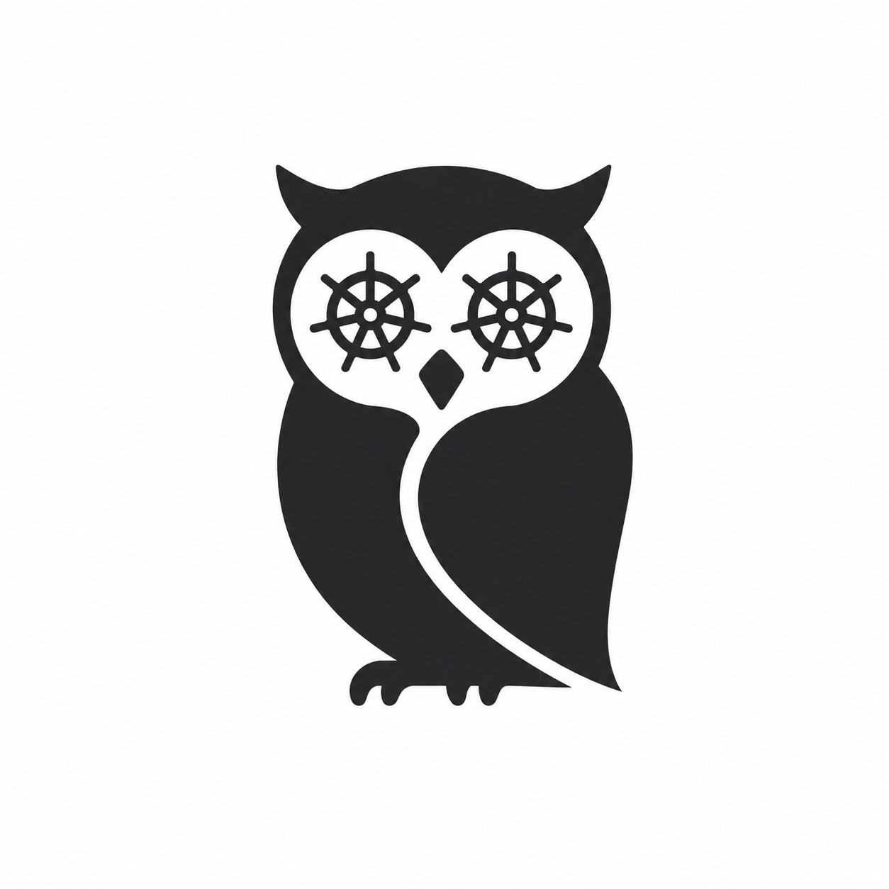

<div align="center">
  
  <h1>Strix</h1>
  <p><em>An owl that watches your Kubernetes cluster.</em></p>
</div>

---

Strix is a terminal-first CLI for Kubernetes with **AI-powered analysis**. It
connects to your cluster using the same kubeconfig rules as `kubectl`, inspects
resources, and explains what is going wrong — using the **Claude Code already
installed on your machine**, so there is no extra API key to manage.

## Status

Early development. Current milestone: connect to a cluster and list resources.

## Roadmap

- [x] Auto-detect kubeconfig (`--kubeconfig` → `$KUBECONFIG` → `~/.kube/config`)
- [x] `strix get pods` — list pods (`-n`, `-A`, `--context`)
- [ ] `strix analyze <resource>` — AI root-cause analysis
- [ ] AI backend: detect local `claude`, fall back to `ANTHROPIC_API_KEY`
- [ ] `strix top nodes --watch` — live resource dashboards (htop-like)
- [ ] `strix logs <pod> --ai`
- [ ] `strix ctx` — switch context

## Build

```bash
go build -o strix .
./strix get pods
```

## Usage

```bash
strix get pods                 # pods in the current namespace
strix get pods -n kube-system  # a specific namespace
strix get pods -A              # across all namespaces
strix get pods --context my-cluster
```
