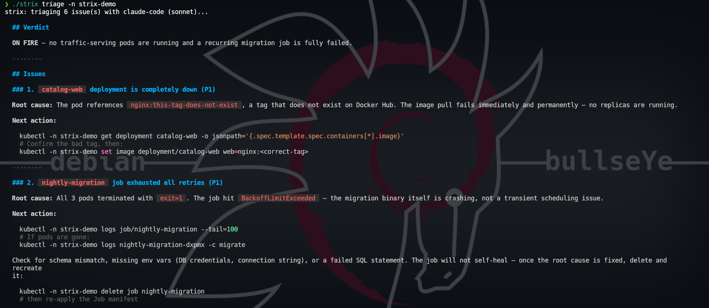
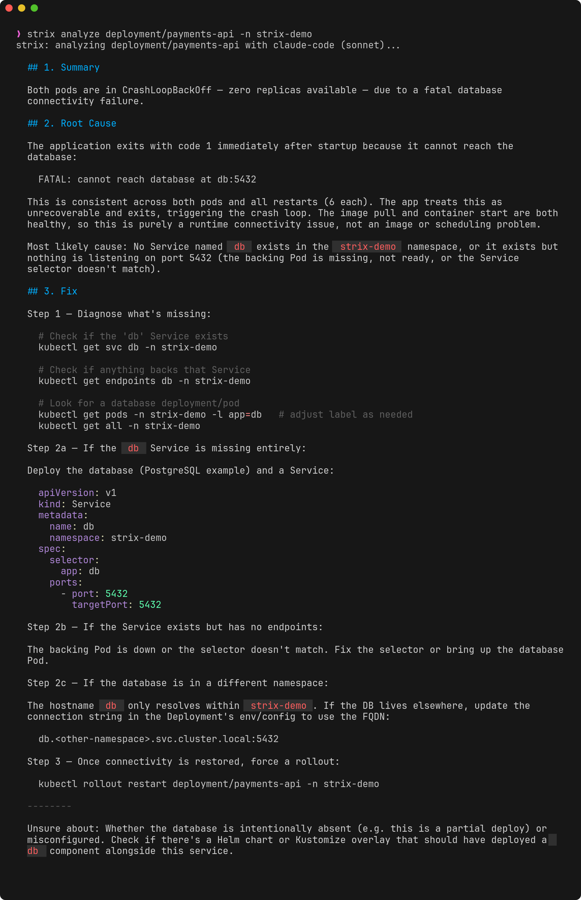

<div align="center">
  <picture>
    <source media="(prefers-color-scheme: dark)" srcset="assets/logo-dark.png" />
    
  </picture>
  <h1>Strix</h1>
  <p><em>An owl that watches your Kubernetes cluster.</em></p>
  <p>
    <a href="https://github.com/dbuzatto/strix/actions/workflows/ci.yml"></a>
    <a href="https://github.com/dbuzatto/strix/releases/latest"></a>
    <a href="LICENSE"></a>
  </p>
</div>

---

Where `kubectl` helps you **browse** a cluster, Strix tells you **what
is wrong and how to fix it**. It gathers a resource's status, events and logs
and hands you a root-cause analysis — right in the terminal. It runs on the
**Claude Code already installed on your machine** (no extra API key to manage),
or the **Anthropic API** when you configure a key.

## Demo

<div align="center">
  
  <p><em>Instant diagnosis — network, dependencies, rollouts and namespace triage, no AI tokens needed.</em></p>
  
  <p><em><code>strix triage</code> — one prioritized report of everything on fire in a namespace.</em></p>
  
  <p><em><code>strix analyze</code> — AI root-cause analysis of a single workload.</em></p>
</div>

## Features

- **AI root-cause analysis** — `strix analyze <kind/name>` gathers status,
  events and logs for pods, deployments, statefulsets, daemonsets, jobs,
  cronjobs, nodes, services and ingresses, then explains the cause and the fix.
- **Network diagnosis** — `strix analyze service/x` / `ingress/x` checks the
  selector-to-pods match, ready endpoints, NetworkPolicies and TLS/backends,
  catching the classic "Service routes to nothing" and 503 causes that never
  show up in logs.
- **Dependency checks** — before calling the AI, Strix verifies the
  ConfigMaps, Secrets and PVCs a pod references actually exist (and PVCs are
  Bound) and that its ServiceAccount is present — a whole class of
  CrashLoopBackOff/Pending failures, surfaced instantly.
- **"What changed"** — `analyze` on a Deployment reconstructs its rollout
  history and flags the image bump in the latest revision, so a regression is
  pinned to a specific rollout you can `kubectl rollout undo`.
- **Namespace triage** — `strix triage` sweeps a namespace (or every namespace)
  and produces a single prioritized report grouping related symptoms. With
  `--json --exit-code` it doubles as a CI/cron cluster-health gate.
- **RBAC made obvious** — `strix can-i <verb> <resource>` answers the
  permission check like `kubectl auth can-i`, but when the answer is *no* it
  explains the gap and prints the exact Role/RoleBinding that would grant it.
- **Live resource usage** — `strix top` shows node and pod CPU/memory with
  htop-style gauges, including a real-time `--watch` dashboard.
- **Bring your own AI** — uses the local Claude Code by default; falls back to
  the Anthropic API with a key. No hosted service in the middle.
- **Terminal-native** — styled Markdown in an interactive terminal; clean raw
  output when piped or saved to a file.

## Install

**Debian / Ubuntu** (`.deb`) — download the package for your architecture from
the [releases page](https://github.com/dbuzatto/strix/releases) and install it:

```bash
sudo apt install ./strix_*_linux_amd64.deb
```

**Fedora / RHEL** (`.rpm`):

```bash
sudo dnf install ./strix_*_linux_amd64.rpm
```

**Go** (any platform with a Go toolchain):

```bash
go install github.com/dbuzatto/strix@latest
```

**Direct download** — grab a prebuilt binary for your OS/arch from the
[releases page](https://github.com/dbuzatto/strix/releases), then extract it and
put `strix` on your `PATH`:

```bash
# Linux (amd64) — adjust the version/OS/arch for your machine
curl -sL https://github.com/dbuzatto/strix/releases/latest/download/strix_<version>_linux_amd64.tar.gz | tar xz
sudo mv strix /usr/local/bin/
```

**From source:**

```bash
go build -o strix .
```

Check your version with `strix version`.

## Try it

On a throwaway cluster (kind, minikube, k3d), apply the demo fixture — fictional
names, deliberately broken workloads — and point Strix at it:

```bash
kubectl apply -f examples/demo.yaml
strix triage -n strix-demo                          # everything on fire, ranked
strix analyze deployment/payments-api -n strix-demo # CrashLoopBackOff root cause
strix analyze service/orphan-svc -n strix-demo      # a Service that routes to nothing
strix analyze service/payments-api -n strix-demo    # zero ready endpoints
strix analyze deployment/report-gen -n strix-demo   # missing Secret + ConfigMap
strix analyze deployment/warehouse -n strix-demo    # unbound PVC

# See the rollout diagnosis: deploy a good image, then break it on a new revision
kubectl -n strix-demo create deployment api --image=nginx:1.25
kubectl -n strix-demo set image deployment/api nginx=nginx:nope
strix analyze deployment/api -n strix-demo          # pins the bad image bump

kubectl delete -f examples/demo.yaml                # clean up
kubectl -n strix-demo delete deployment api         # (the imperative one)
```

## Usage

```bash
strix analyze pod/api-7d9f -n prod              # root-cause analysis of a pod
strix analyze deployment/api -n prod            # analyze a deployment + its pods
strix analyze statefulset/postgres -n data      # statefulset + its pods
strix analyze cronjob/nightly-backup -n ops     # cronjob + its most recent runs
strix analyze node/worker-3                     # node pressure, taints & scheduling
strix analyze service/api -n prod               # endpoints, selector & NetworkPolicy
strix analyze ingress/web -n prod               # backends, TLS & routing
strix analyze deployment/api -o report.md       # save the report to a file
strix analyze pod/api-7d9f --raw                # print gathered evidence, skip the AI
strix analyze pod/api-7d9f --lang pt            # answer in Portuguese
strix analyze pod/api-7d9f --prompt "por que reinicia?"   # your own question
strix analyze deployment/api -m opus           # pick the Claude model
```

| Flag | Purpose |
| --- | --- |
| `--prompt` | Your own question, replacing the default root-cause template |
| `--lang` | Language of the answer (`pt`, `en`, `"português"`, …) |
| `-m, --model` | Claude model: `opus`, `sonnet`, `haiku`, or a full id |
| `--raw` | Print the gathered evidence without calling the AI |
| `--plain` | Plain text output, no Markdown rendering or color |
| `-o, --out` | Write the result to a file |
| `--tail` | Log lines gathered per container (default 100) |

On an interactive terminal the AI's Markdown answer is rendered to styled ANSI
(bold, colors, bullets). When output is piped or written with `-o`, raw Markdown
is emitted so files and downstream tools stay clean.

### Triage a whole namespace

When you don't yet know *what* is broken, let Strix find it:

```bash
strix triage -n prod            # scan one namespace and rank what is on fire
strix triage -A                 # sweep every namespace
strix triage -n prod --raw      # print the raw findings, skip the AI
strix triage -n prod --lang pt  # report in Portuguese
strix triage -A --json --raw    # structured findings for scripts (no AI cost)
strix triage -A --json --exit-code   # CI/cron gate: exit 2 if anything is wrong
```

`triage` sweeps for unhealthy pods, workloads below their desired replicas,
failed jobs and recent warning events, then produces a single prioritized
report grouping related symptoms. It gathers only status and events (no logs),
so it stays fast and cheap; drill into anything it flags with
`strix analyze <kind/name>`.

For automation, `--json` emits `{scope, healthy, issues, findings[], report}`
and `--exit-code` makes the command exit **2** when any issue is found (0 =
clean, 1 = a Strix error) — drop it into a CI step or a cron job to fail the
build or alert when a cluster degrades.

### Check RBAC permissions

`Forbidden` errors are among the most common — and most confusing — in
Kubernetes. `strix can-i` answers the access check and, when it's denied, tells
you exactly how to fix it:

```bash
strix can-i create deployments -n prod
strix can-i get pods/api-7d9f -n prod
strix can-i list nodes                                  # cluster-scoped resource
strix can-i create secrets -n prod --as system:serviceaccount:prod:ci
strix can-i delete pods -n prod --as alice@example.com  # impersonate a user
```

When the answer is *no*, Strix lists the subject's current grants and prints a
ready-to-apply `Role`/`RoleBinding` (or `ClusterRole`/`ClusterRoleBinding` for
cluster-scoped resources) that closes the gap — no hand-writing RBAC YAML. It
resolves resource shorthands (`deploy`, `po`) and API groups exactly like
`kubectl`.

### AI backend

The backend is auto-detected: if the `claude` CLI is installed and logged in,
Strix uses it (no API key needed); otherwise it uses the Anthropic API with the
`api_key` from your config (or the `ANTHROPIC_API_KEY` environment variable).
Set `backend` in the config to force one — `claude-code`, `api`, or `auto`
(default). With the API backend, `model` accepts `opus`/`sonnet`/`haiku` or a
full model id.

### Resource usage

```bash
strix top nodes                    # node CPU/memory with usage gauges
strix top pods -A                  # pod usage across all namespaces
strix top pods -l app=api          # filter pods by label selector
strix top deployment/api -n prod   # usage of just a deployment's pods
strix top nodes --watch            # live htop-style dashboard (q to quit)
```

`top` reads the metrics-server (`metrics.k8s.io`); `--watch` takes over the
screen and returns you to the shell on `q`.

## Configuration

Set defaults once instead of passing flags every time. Generate the file with:

```bash
strix config init     # writes ~/.config/strix/config.yaml
strix config path     # show where it lives
```

```yaml
# ~/.config/strix/config.yaml
model: opus           # default Claude model (opus, sonnet, haiku, or a full id)
lang: pt              # default answer language
tail: 100             # log lines gathered per container
backend: auto         # auto | claude-code | api
api_key: ""           # Anthropic API key for the 'api' backend (keep private)
```

Precedence is **flag > config file > built-in default**. The path honors
`$STRIX_CONFIG` and `$XDG_CONFIG_HOME`. The file is written `0600` since it may
hold your API key; leave `api_key` empty to use `ANTHROPIC_API_KEY` instead.

## Support

If Strix saves you time, you can support its development. Contributions are
entirely optional and help keep the project moving.

**Pix** (Brazil) — random key, copy and paste into your bank app:

```
b97729f3-534f-427c-a820-b3751c053538
```

## Partnerships & Contact

Strix is open to collaboration. If you're interested in partnering, sponsoring,
integrating Strix into your tooling, or just want to talk about where it's
heading, reach out — **diogobuzattoo@gmail.com**. Bug reports and feature ideas
are welcome as GitHub issues.

## License

Strix is released under the [MIT License](LICENSE) — free to use, modify and
distribute, with attribution. © 2026 Diogo Buzatto.
